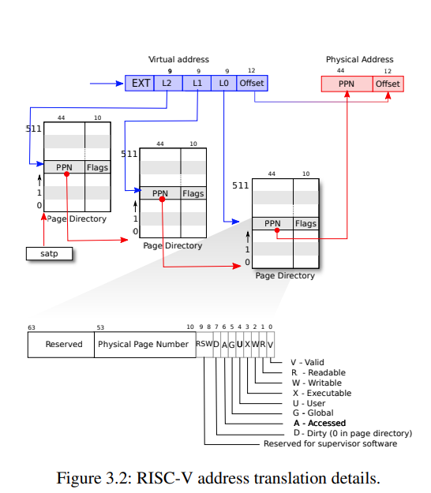
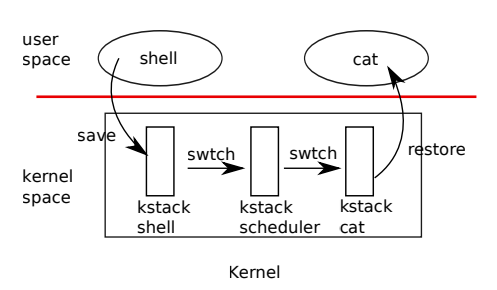

# Lab Report

## lab1 utilities
### 功能
+ 实现一些简单的Unix程序，例如`sleep, find, xargs`
+ 利用管道进行进程间通信 `pingpong`
+ 一个并发的素数筛选程序 `primes`

### 笔记
+ 并发素数程序有点意思，可参考[这个网站](https://swtch.com/~rsc/thread/)

## lab2 system calls
### 功能
实现两个系统调用
+ 追踪系统调用 `trace`
+ 收集系统信息 `sysinfo`

### 笔记
+ 用户态的函数可以直接传递参数，而系统调用不能直接传递参数，必须通过寄存器。内核读取寄存器来保存参数(`argint,argaddr`)。
+ 内核函数不能直接访问用户空间，必须通过特殊的方式将内存从内核拷贝到用户空间。例如在如下系统调用中，内核必须通过`copyout()`把`struct sysinfo`拷贝回用户空间。
  ```c
  int sysinfo(struct sysinfo*);
  ```

## lab3 page tables
### 功能
+ 通过在用户与内核之间只读的一块区域共享数据来加速`getpid`系统调用
+ `vmprint()` 打印进程的页表
+ `pgaccess() `检测并报告用户空间访问了哪些页

### 笔记

+ RISC-V页表结构



## lab4 traps

### 功能

+ `backtrace()` 使用帧指针遍历堆栈，并打印堆栈帧上保存的返回地址
+ 系统调用`sigalarm()`。若一个应用程序调用`sigalarm(n, fn)`，则CPU每运行 `n` ticks后，内核都应调用函数`fn`。当`fn`返回时，应用程序应从在中断的地方继续执行。
  + 更一般地说，`fn`是一个用户级中断/错误处理程序

### 笔记

+ trap()的过程：`trampoline.S->usertrap()->kernel->usertrapret()->trampoline.S`


+ 进程在发生trap时，把寄存器的状态保存在`TRAPFRAME`中。trap结束返回到用户空间时，恢复到发生trap前的寄存器状态
  + 在本实验中，`sigalarm`会注册一个警告函数，当发生时钟中断且满足tick要求时，调用警告函数，警告函数完成后会调用`sigreturn`。
  + 警告函数在用户空间运行，可能会改变寄存器的值，所以在调用警告函数前，需要保存当前的寄存器状态。在警告函数结束后，通过`sigreturn`恢复到发生时钟中断之前的状态。
+ 通过改变epc寄存器中保存的地址，可以改变用户接下来要执行的命令
+ 系统调用返回值保存在a0寄存器

## lab5 copy-on-write fork

实现写时复制的fork函数

+ `fork()`仅为子进程创建一个页表，其中用于用户内存的PTE指向父进程物理页，父子进程所有用户PTE都标记为只读。
+ 当任一进程尝试写入这些 COW 页之一时，CPU 将强制出现page fault。`usertrap()`检测到这种情况，使用`kalloc()`分配物理内存，将原始页面复制到新页面中，并修改PTE引用新页面，这次 PTE 标记为可写。
  + `usertrap()`通过读取scause寄存器的值，来判断中断的类型
  + 最初为只读的页面，应保持只读并在父进程和子进程之间共享。尝试写此类页面的进程应该被`kill()`
+ 每个物理页在最后一个 PTE 引用消失时被释放。
  + 使用数组记录每个物理页面被引用的次数：`int refcnt[PHYMEM/PGSIZE]`
  + `kalloc()`设置为1，`fork()`时+1，`kfree()`时-1
  + `kfree()`应该只在引用计数为0时，将页面放回自由列表

## lab6 multithreading

### 功能
+ 为用户级线程实现上下文切换机制
+ 在Linux系统，使用phread库
  + 使用互斥锁实现哈希表存取的并行
  + 使用互斥锁和条件变量实现线程之间的同步

### 笔记

+ 上下文切换：`usertrap()->yield()->sched()->swtch()->scheduler()`
  + 在`swtch()`时保存所有寄存器到context
  + `swtch()`结束后返回到指向上一次调用`swtch()`的返回位置（`scheduler()`），这个位置保存在context的ra寄存器中
  + 在上下文切换时，p->lock必须持有，否则可能会发生问题：在`yield()`将进程设为RUNNABLE后，`swtch()`切换内核栈前，其他cpu也运行了这个进程，两个CPU运行在一个栈上
  + p->lock在线程间传递：在`yield()`获得的锁，在`scheduler()`释放，反之亦然。



+ 同步：通过`sleep`和`wakeup`实现条件同步机制。在进程需要等待IO时，使用`sleep`睡眠进程（加入等待队列），将cpu让给其他进程使用，等待结束后再调用`wakeup`唤醒睡眠的进程。
  + `sleep`应该释放锁，让进程睡眠，被唤醒后需要重新获取锁。
  + `sleep`操作应该是原子的。
  + 只有满足这些要求，才不会产生**死锁**以及**lost wakeup**问题。
  
+ POSIX <pthread.h>的使用 （更多信息可以使用`man pthreads`命令查看）

```c
pthread_mutex_t lock;            // declare a lock
pthread_mutex_init(&lock, NULL); // initialize the lock
pthread_mutex_lock(&lock);       // acquire lock
pthread_mutex_unlock(&lock);     // release lock

pthread_cond_wait(&cond, &mutex);  // go to sleep on cond, releasing lock mutex, acquiring upon wake up
pthread_cond_broadcast(&cond);     // wake up every thread sleeping on cond
```

## lab7 network driver

### 功能

+ 为E1000网卡实现一个设备驱动，使xv6能够处理网络通信：发送和接收数据包

### 笔记

+ 从控制台输入：
  + 控制台绑定了一个文件描述符上，系统调用`read()`读取这个文件时调用`consoleread()`。`consoleread()`在控制台缓冲区没有一整行时，进入等待状态。
  + 用户输入，UART发起中断。中断处理函数`usertrap()`调用`devintr()`
  + `devintr()`查看RISC-V的*scause*寄存器，发现中断是来自外部设备（而非时钟）。然后询问PLIC是哪个设备发起的中断。如果是UART，调用`uartintr()`
  + `uartintr()`从UART读一个字符，传入到`consoleintr()`
  + `consoleintr()`将字符保存在控制台的缓冲区，直到有一整行到达
  + 当新行到达时，`consoleintr()`唤醒正在等待的`consoleread()`
  + `consoleread()`会把控制台的缓冲区的一行返回到用户空间
+ 当一个设备在不可预测的时间需要关注时，中断是有意义的，但中断有很高的CPU开销。因此，高速设备，如网络和磁盘控制器，使用一些技巧来减少对中断的需求。
  + 为整批传入或传出的请求引发一个中断
  + **轮询（polling）**：驱动程序完全禁用中断，并定期检查设备，看它是否需要注意
  + 如果设备执行操作非常快，轮询是有意义的，但如果设备大部分时间是空闲的，它就会浪费CPU时间。一些驱动程序根据当前的设备负载，在轮询和中断之间动态切换。
+ UART驱动首先将传入的数据复制到内核中的一个缓冲区，然后再复制到用户空间，对于高速设备来说，这种双重复制会大大降低性能。使用**DMA**可以直接在内存和设备之间传输数据，不需要CPU处理。

## lab8 locks

## lab9 file system

## lab10 mmap
