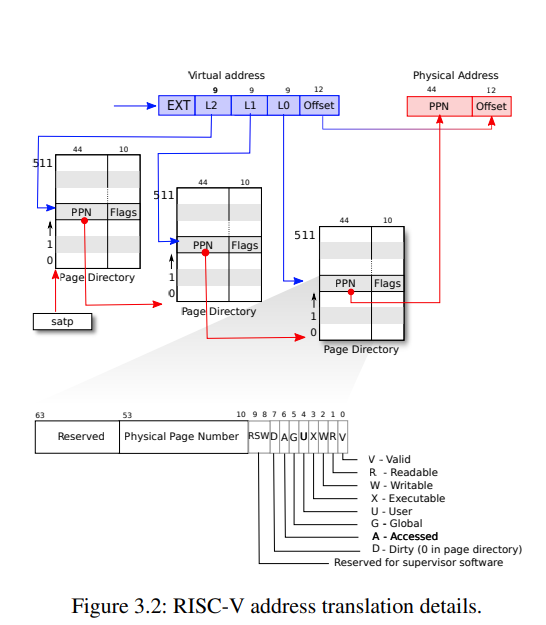

# Lab Report

## lab1 utilities
### 实现功能
+ 实现一些简单的Unix程序，例如`sleep, find, xargs`
+ 利用管道进行进程间通信 `pingpong`
+ 一个并发的素数筛选程序 `primes`

### 个人收获
+ 并发素数程序有点意思，可参考[这个网站](https://swtch.com/~rsc/thread/)

## lab2 system calls
### 实现功能
实现两个系统调用
+ 追踪系统调用 `trace`
+ 收集系统信息 `sysinfo`

### 个人收获
+ 用户态的函数可以直接传递参数，而系统调用不能直接传递参数，必须通过寄存器。内核读取寄存器来保存参数(`argint,argaddr`)。
+ 内核函数不能直接访问用户空间，必须通过特殊的方式将内存从内核拷贝到用户空间。例如在如下系统调用中，内核必须通过`copyout()`把`struct sysinfo`拷贝回用户空间。
  ```c
  int sysinfo(struct sysinfo*);
  ```

## lab3 page tables
### 实现功能
+ 通过在用户与内核之间只读的一块区域共享数据来加速`getpid`系统调用
+ `vmprint()` 打印进程的页表 
+ `pgaccess() `检测并报告用户空间访问了哪些页 

### 个人收获

+ RISC-V页表结构



## lab4 traps

### 实现功能

+ `backtrace()` 使用帧指针遍历堆栈，并打印堆栈帧上保存的返回地址
+ 系统调用`sigalarm()`。若一个应用程序调用`sigalarm(n, fn)`，则CPU每运行`n`滴答后，内核都应调用函数`fn`。当`fn`返回时，应用程序应从在中断的地方继续执行。
  + 更一般地说，这是一个用户级中断/错误处理程序

### 个人收获

+ 在`usertrap()`中处理trap（包括时钟中断等）
+ 进程在发生trap时，把寄存器的状态保存在`TRAPFRAME`中。trap结束返回到用户空间时，恢复到发生trap前的寄存器状态
  + 在本实验中，`sigalarm`会注册一个警告函数，当发生时钟中断且满足tick要求时，调用警告函数，警告函数完成后会调用`sigreturn`。
  + 警告函数在用户空间运行，可能会改变寄存器的值，所以在调用警告函数前，需要保存当前的寄存器状态。在警告函数结束后，通过`sigreturn`恢复到之前的状态。
+ 通过改变epc寄存器中保存的地址，可以改变用户接下来要执行的命令
+ 系统调用返回值保存在a0寄存器

## lab5 copy-on-write fork

实现写时复制的fork函数

+ `fork()`仅为子进程创建一个页表，其中用于用户内存的PTE指向父进程物理页，父子进程所有用户PTE都标记为只读。
+ 当任一进程尝试写入这些 COW 页之一时，CPU 将强制出现page fault。`usertrap()`检测到这种情况，使用`kalloc()`分配物理内存，将原始页面复制到新页面中，并修改PTE引用新页面，这次 PTE 标记为可写。
  + `usertrap()`通过读取scause寄存器的值，来判断中断的类型
  + 最初为只读的页面，应保持只读并在父进程和子进程之间共享。尝试写此类页面的进程应该被`kill()`
+ 每个物理页在最后一个 PTE 引用消失时被释放。
  + 使用数组记录每个物理页面被引用的次数：`int refcnt[PHYMEM/PGSIZE]`
  + `kalloc()`设置为1，`fork()`时+1，`kfree()`时-1
  + `kfree()`应该只在引用计数为0时，将页面放回自由列表

## lab6 multithreading

## lab7 network driver

## lab8 locks

## lab9 file system

## lab10 mmap
